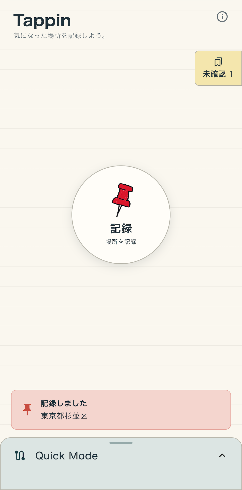
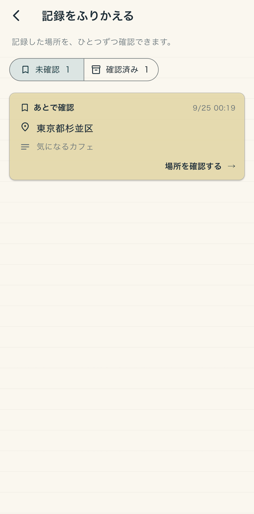
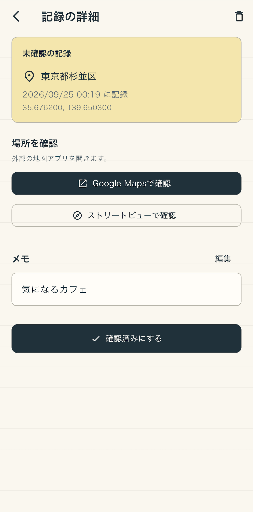

# Tappin

移動中に見つけた気になる場所を、ワンタップで記録して、あとから地図で確認するためのFlutterアプリです。

「気になったけど、今は立ち止まって調べられない」という場面で、できるだけ少ない操作で場所だけ残せるようにしています。

🍎 **App Store**\
[https://apps.apple.com/jp/app/tappin/id6814894333](https://apps.apple.com/jp/app/tappin/id6814894333)

📝 **開発・公開までの記事**\
[https://zenn.dev/tofu575/articles/12c863e7a19c59](https://zenn.dev/tofu575/articles/12c863e7a19c59)

<p align="center">
  
  
  
  
</p>

## Tappinとは

散歩や旅行、公共交通機関での移動中には、あとで詳しく調べたい店や場所を見つけても、その場で検索して保存する余裕がないことがあります。Tappinは、そうした場所を現在地としてすばやく記録し、落ち着いたあとに振り返るためのアプリです。

記録した場所は「未確認」と「確認済み」に分けて管理できます。詳細画面では住所の確認、メモの追加、Google Mapsやストリートビューへの移動ができます。

> [!IMPORTANT]
> 自動車や自転車の運転中など、端末操作が危険な状況での利用は想定していません。必ず安全な状況で操作してください。

## 主な機能

- ホーム画面からワンタップで現在地を記録
- 画面全体をタップして連続で記録できるQuick Mode
- 記録を「未確認」「確認済み」に分けて管理
- 記録した日時・座標・住所・メモを詳細画面で確認
- Google Mapsやストリートビューで記録地点を表示

## 技術構成

| 分類 | 技術・パッケージ |
| --- | --- |
| UI | Flutter / Material |
| 状態管理・DI | Riverpod / Hooks Riverpod |
| UIライフサイクル | Flutter Hooks |
| 位置情報 | Geolocator |
| 端末内保存 | MethodChannel / SQLite / SharedPreferences |
| 外部地図連携 | URL Launcher |
| 表示文言管理 | Flutter gen-l10n / ARB |
| 開発環境管理 | FVM |

依存パッケージは再現性を保つため、検証済みのバージョンに固定しています。

## アーキテクチャ

Clean Architectureを採用し、外部機能の詳細がDomainへ入り込まないようにしています。依存方向は次のとおりです。

```text
Presentation → interactorProvider → Interactor → Gateway interface ← Gateway実装
```

`Presentation`と`Gateway`はどちらも`Domain`に依存し、互いには依存しません。Presentationは構築済みの`Interactor`だけを`interactorProvider`から受け取り、位置情報、永続化、住所検索、ハプティクス、外部地図などはGateway interfaceを介して利用します。

```text
lib/
├── domain/
│   ├── model/          # Entity・Value Object
│   └── usecase/        # Interactor・Gateway interface
├── gateway/            # 端末機能や外部機能へ接続するGateway実装
├── presentation/
│   ├── pages/          # 各画面と画面固有のComponent
│   ├── providers/      # Riverpod Provider / 非同期状態
│   ├── theme/          # テーマとカラー
│   └── widgets/        # 画面間で共有するWidget
├── l10n/               # ARBと生成されたローカライズコード
├── app.dart
└── main.dart           # Gatewayの構築と依存注入
```

依存注入はアプリ起動時に`main.dart`で行い、構築済みのInteractorを`interactorProvider.overrideWithValue()`で渡します。

## UIレビュー

主要画面を継続して確認できるように、`integration_test`とMock Gatewayを使ったスクリーンショット生成テストを用意しています。

テストデータには固定値を使用するため、位置情報、住所検索、端末内DB、ネットワークの状態に依存せず、次の画面を同じ条件で再現できます。

- オンボーディング
- 未確認の記録が0件／存在する場合のホーム
- 未確認／確認済みの履歴
- 記録詳細
- Quick Modeの案内・記録中・記録成功後

Android Emulatorを起動し、表示されたdevice IDを指定して実行します。

```bash
fvm flutter emulators --launch Pixel_5_API_33

fvm flutter drive \
  --driver=test_driver/ui_review_test_driver.dart \
  --target=integration_test/ui_review_test.dart \
  -d <device-id>
```

生成されたPNGは`screenshots/ui_review/`に保存されます。同じテストはiOS Simulatorでも実行できます。

## 開発環境

### セットアップ

[FVM](https://fvm.app/)を利用します。このリポジトリで指定しているFlutter SDKは`.fvm/fvm_config.json`で確認できます。

```bash
fvm install
make pub-get
```

### アプリの起動

接続済みの実機または起動済みのSimulator / Emulatorで実行します。

```bash
make flutter-run-device
```

Pixel 5 API 33のAndroid Emulatorを使う場合は、起動とアプリ実行をまとめて行えます。

```bash
make flutter-run-emulator
```

### 静的解析とテスト

```bash
make analyze
make test
```

コードを整形する場合は次を実行します。

```bash
make format
```

## 関連リンク

- [App Store](https://apps.apple.com/jp/app/tappin/id6814894333)
- [開発・公開までの記事（Zenn）](https://zenn.dev/tofu575/articles/12c863e7a19c59)
- [プライバシーポリシー](https://tofu575.com/tappin/privacy/)
- [利用規約](https://tofu575.com/tappin/terms/)

Copyright © 2026 tofu575. All rights reserved.
